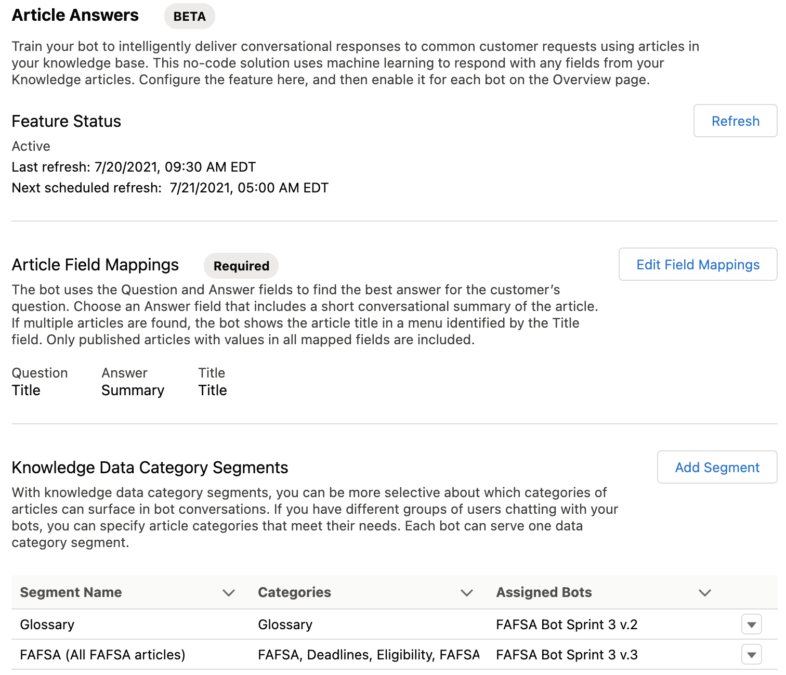
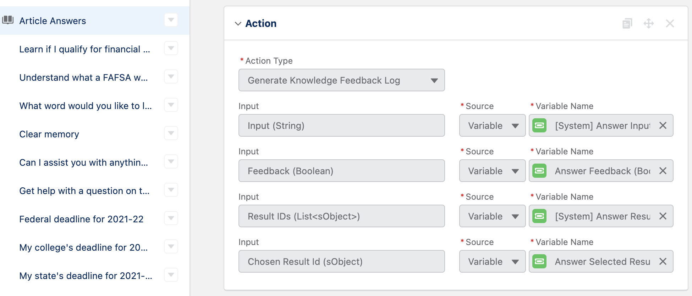

## Post-Deployment: Load Datasets
### FAFSA Deadlines
Use the **Salesforce Data Import Wizard** to import the [FAFSA Deadlines CSV dataset](https://github.com/Salesforce-org-Impact-Labs/FinAid/blob/main/datasets/FAFSA%20Deadlines.csv) into the **FAFSA Deadlines** custom object (`FAFSA_Deadlines__c`). Note: you have to download the CSV file for the steps below.

1. Using the Salesforce Lightning experience UI, go to **Setup -> Integrations -> Data Import Wizard** or search for "data import" in Setup's Quick Find box. Select **Data Import Wizard** to bring up the **Data Import Wizard** page.
2. Locate and click on the **Launch the Wizard!** button.
3. Once in the wizard page, select the **FAFSA Deadlines** custom object from the **Custom objects** tab.
4. Under the **What do you want to do?** section,
   1. Choose **Add new and update existing records** 
   2. Choose the `Name` field in the **Match by** picklist. 
   3. Keep the **Trigger workflow rules and processes?** checkbox unchecked
5. Under the **Where is your data located?** section,
   1. Drop the [FAFSA Deadlines CSV dataset](https://github.com/Salesforce-org-Impact-Labs/FinAid/blob/main/datasets/FAFSA%20Deadlines.csv) you have downloaded in the designated place on the page 
   2. Alternatively, click on the **CSV** icon to locate specify the file from your local drive
6. On the next step, review the field mappings. _There should be no need to edit as the CSV file headers match the custom object field labels._ Click **Next** and start the import.

### Knowledge Articles

#### Load Knowledge Articles
Use the **Import Articles**  utility to insert or upsert [FAFSA Knowledge Articles CSV dataset](https://github.com/Salesforce-org-Impact-Labs/FinAid/blob/main/datasets/FAFSA%20Knowledge%20Articles.csv) into the Knowledge object (`Knowledge__kav`).
 
1. Download the following and zip them together in a single zip file
   1. [FAFSA Knowledge Articles CSV dataset](https://github.com/Salesforce-org-Impact-Labs/FinAid/blob/main/datasets/FAFSA%20Knowledge%20Articles.csv)
   2. [FAFSA Knowledge Import.properties](https://github.com/Salesforce-org-Impact-Labs/FinAid/blob/main/datasets/FAFSA%20Knowledge%20Import.properties)
2. If necessary, create and activate the data categories and groups below before uploading. Their API names must match the CSV file values in the `datacategorygroup.FAFSA` column:
   1. `FAFSA` data category group, under which are the data categories below
   2. `Form_Questions`
   3. `Terminology`
   4. `FAFSA_Deadline`
3. If existing Knowledge Articles conflict with the CSV entries, archive the existing articles first using the **Knowledge** item in the Salesforce Lightning experience UI. Note: the **Knowledge** item is usually included in the **Service** and **Service Console** apps
4. Using the Salesforce Lightning experience UI, go to **Setup -> Data -> Import Articles** or search for "article" in Setup's Quick Find box and click on **Import Articles**. This should bring up the **Import Articles** page.
5. On the **Import Articles** page, step 4,
   1. Select **Knowledge** in the **Knowledge Base** drop down box 
   2. Choose the zip file you created in step 1.

#### Publish the Knowledge Articles
Knowledge Articles from the [FAFSA Knowledge Articles CSV dataset](https://github.com/Salesforce-org-Impact-Labs/FinAid/blob/main/datasets/FAFSA%20Knowledge%20Articles.csv) load as **draft** articles. They must be published in order to be consumed by the FAFSA Bot. Use the **Knowledge** item in the Salesforce Lightning experience UI to publish the articles.

#### (Re)Train the Bot to Use Latest Knowledge Articles
After articles have been published, the bot has to learn about them. This happens on schedule but it can also be initiated manually.
1. Using the Salesforce Lightning experience UI, go to **Setup -> Feature Settings -> Service -> Service Cloud Einstein -> Einstein Bots** or search for "bot" in **Setup -> Quick Find** and click **Einstein Bots** to bring up the **Einstein Bots** page.
2. On the **Einstein Bots** page click on the **Refresh** button under the **Article Answers** section (see image below). This should initiate the bot training, which could take hours, depending on the number of articles.
3. On the same page, make sure the **Article Field Mappings** section specify that
   - **Question** maps to the `Title` `Knowledge` object field
   - **Answer** maps to the `Summary` `Knowledge` object field
4. On the same page, make sure the **Knowledge Data Category Segments** indicate that the bot version you want to use, include all the data categories and groups you want to bot to know about. For example,
   1. `FAFSA` data category group that includes the data categories below
   2. `Form_Questions` data category
   3. `Terminology` data category
   4. `FAFSA_Deadline` data category

 
### Utterances
Use the **Salesforce Data Loader** to insert or upsert the utterances datasets below into the Intent Utterance object (`MIIntentUtterance`). Note that the CSV Heading `MlDomainName` = Bot's API name, `Alpha1`

1. [FAFSA Bot Utterances - Application Questions.csv](https://github.com/Salesforce-org-Impact-Labs/FinAid/blob/main/datasets/FAFSA%20Bot%20Utterances%20-%20Application%20Questions.csv). Applies to the bot  `FAFSA_Application_Form_Question` dialog (Get help with a question on the FAFSA application)
2. [FAFSA Bot Utterances - Deadlines.csv](https://github.com/Salesforce-org-Impact-Labs/FinAid/blob/main/datasets/FAFSA%20Bot%20Utterances%20-%20Deadlines.csv). Applies to the `Key_Events_and_Deadlines` dialog (Check a deadline date)
3. [FAFSA Bot Utterances - Eligibility.csv](https://github.com/Salesforce-org-Impact-Labs/FinAid/blob/main/datasets/FAFSA%20Bot%20Utterances%20-%20Eligibility.csv). Applies to the `FAFSA_Eligibility` dialog (Learn if I qualify for financial aid)
4. [FAFSA Bot Utterances - Terminology.csv](https://github.com/Salesforce-org-Impact-Labs/FinAid/blob/main/datasets/FAFSA%20Bot%20Utterances%20-%20Terminology.csv). Applies to the `FAFSA_Words` dialog (Understand what a FAFSA word means)

Note: make sure the dialogs referenced above are intent-enabled before uploading the data set.


## Work Around Current Issues
### Work around [Issue #34](https://github.com/Salesforce-org-Impact-Labs/FinAid/issues/34)
#### Issue Summary
The bot's **Bot User** setting must be set to a **Custom Chatbot User** instead of **Basic Chatter User** in order to have access to Salesforce Knowledge. The **Custom Chatbot User** setting requires a user with access to Knowledge to be specified. However, committing this configuration to the repo, can cause problems when deploying from the repo with a message such as:

>_Invalid value for Bot User field given. ERROR running force:source:push: Push failed_

#### Work-Around

Do the pre- and post-deployment steps in this section if the bot was committed to the repo with the `Bot User` setting set to a `Custom Chatbot User`, which when enabled requires a user to be specified. This is the case if element  `<botUser>USER_NAME</botUser>` element exists in `Alpha1.bot-meta.xml` metadata file under `force-app/main/default/bots`
##### Pre-Deployment
Manually delete the following element  `<botUser>USER_NAME</botUser>` from `Alpha1.bot-meta.xml` metadata file under `force-app/main/default/bots`

##### Post-Deployment
Reconfigure the bot to set the **Bot User** setting to a **Custom Chatbot User** and specify a user that has access to Knowledge, which the bot requires. Note that the bot must be deactivated in order to edit settings.

. 

To get to the page shown in the image above,
1. Go to **Setup -> Feature Settings -> Service -> Service Cloud Einstein -> Einstein Bots** or search for "bot" in **Setup -> Quick Find** and click **Einstein Bots" to bring up the **Einstein Bots** page
2. On the **Eintein Bots** page, go to the **My Bots** section (_you may have to scroll down the page_) and click on the bot version you want to edit, e.g., **Version 3**. This brings up the **Einstein Bot Builder** page.
3. On the **Einstein Bot Builder** page, bring up the **Overview** page using the pick list on the top left corner of the page. Set the **Bot User** setting to use a **Custom Chatbot User** and specify a user that has access to Knowledge.

### Work around issue [Issue #36](https://github.com/Salesforce-org-Impact-Labs/FinAid/issues/36)
#### Issue Summary

Deployment using `cci flow run dev_org --org dev` (when creating a dev scratch org) and `sfdx force:source:deploy` fails with the error message below when using Article Answers

>_Invocation Target ID: bad value for restricted picklist field: generateKnowledgeLogData_

The deployment succeeds and the message disappears if the **Article Answers** dialog's **Generate Knowledge Feedback Log** action is deleted.

#### Work-Around

Do the following work around **if and only if** a bot version you want to deploy uses  **Article Answers**.

##### Pre-Deployment
Manually delete the **Article Answers** dialog's **Generate Knowledge Feedback Log** action in the `v3.botVersion-meta.xml` metadata file.

1. Locate the **Article Answers** dialog. Search for `<label>Article Answers</label>` in the `v3.botVersion-meta.xml` metadata file or whichever version of the bot you're trying to deploy under `force-app/main/default/bots`.
2. In the **Article Answers** dialog, locate `<botSteps>` that has the **Generate Knowledge Feedback Log** action and delete it. It should look something like the XML block below.
3. Repeat steps above for all versions that use **Article Answers** you want to deploy.
```   
<botDialogs>
    <!-- START of botSteps to delete -->
    <botSteps>
        <botInvocation>
            <invocationActionName>generateKnowledgeLogData</invocationActionName>
            <invocationActionType>logFeedback</invocationActionType>
        </botInvocation>
        ...
    </botSteps>
    <!-- END of botSteps to delete -->
    ...
    <description>Article Answers (Beta) can be used instead of the FAFSA Terms dialog</description>
    <developerName>Answer_Automation</developerName>
    <label>Article Answers</label>
    <showInFooterMenu>false</showInFooterMenu>
</botDialogs>
```
##### Post-Deployment
Restore the **Article Answers** dialog's **Generate Knowledge Feedback Log** action as shown in the image below. Do this for every metadata file from which it was manually deleted, e.g., `v3.botVersion-meta.xml` metadata file.

The action should be right after the **Was this useful?** question action of the **Article Answers** dialog. Basically, it just logs the user's answer to the question and its context.



To get to the page shown in the image above,
1. Go to **Setup -> Feature Settings -> Service -> Service Cloud Einstein -> Einstein Bots** or search for "bot" in **Setup -> Quick Find** and click **Einstein Bots** to bring up the **Einstein Bots** page
2. On the **Einstein Bots** page, go to the **My Bots** section and click on the FAFSA Bot version you want to edit, e.g., **Version 3**. This brings up the **Einstein Bot Builder** page.
3. On the **Einstein Bot Builder** page, switch to **Dialogs** using the pick list on the top left corner. Find the **Article Answers** dialog and click on it to edit it and add a **Generate Knowledge Feedback Log** action right after the the **Was this useful?** question action. NOTE: You have to deactivate the bot to edit.

### Work around issue [Issue #41](https://github.com/Salesforce-org-Impact-Labs/FinAidBot/issues/41)
#### Issue Summary
When deploying an Einstein Bot with a dialog that has a **Question** step setting configured as follows:
``` 
If the variable already contains a value:
   [ ] Skip question and use existing value
   [x] Ask question and overwrite the value
```
the setting reverted back to the following after deployment:
``` 
If the variable already contains a value:
   [x] Skip question and use existing value
   [ ] Ask question and overwrite the value
```

#### Work-Around
This work-around requires knowing the **Question** step setting as it was configured during development. This requires coordiation with the developer as there is no good way of knowing this from GitHub. 

##### Post-Deployment
For every dialog that has a **Question** step, restore the setting as it was configured during development:
``` 
If the variable already contains a value:
   [ ] Skip question and use existing value
   [x] Ask question and overwrite the value
```

Currently, this applies to the following dialogs:
1. Article Answers (API name: `Answer_Automation`)
   1. Question _I found the following articles_
3. Can I assist you with anything else? (API name: `FAFSA_Anything_Else`)
   1. Question _Can I assist you with anything else?_
4. Federal deadline for 2021-22 (API name: `Federal_deadline_for_2021_22`)
   1. Question _Would you like to create a calendar reminder for the Federal Deadline?_
6. My college's deadline for 2021-22 (API name: `My_college_s_deadline_for_2021_22`)
   1. Question _Which college do you want to check the deadline for?_
   2. Question _Do you want to check another college's deadline?_
7. My state's deadline for 2021-22 (API name: `My_state_s_deadline_for_2021_22`)
   1. Question _What state do you want to check the deadline for?_
   2. Question _o you want to check another state's deadline?_
